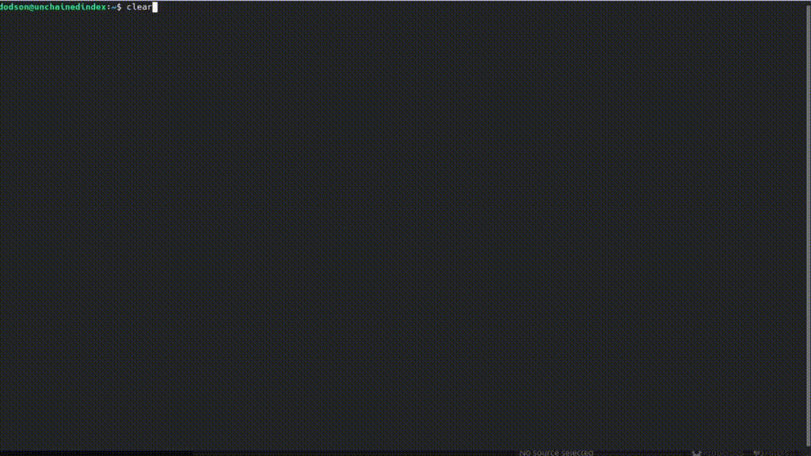

# TrueBlocks Core

Ethereum as it was meant to be: local-first, P2P, and accurate queries to all the data you’ll ever need.

## Installing

This is a work in progress. See [What works now?](#_what_works_now) for known issues.

The following instructions help you compile the `core` tools from the TrueBlocks github repo. If you want to use our browser front-end, see [TrueBlocks Explorer.](https://github.com/TrueBlocks/trueblocks-explorer) For a docker image, see [TrueBlocks Docker](https://github.com/TrueBlocks/trueblocks-docker)

1.  Install dependencies

    **For Linux**:

        sudo apt install build-essential git cmake python python-dev libcurl3-dev clang-format jq

    **For Mac**:

We recommend that you run MacOS Big Sur or later for best results.

\+

    brew install cmake
    brew install git
    brew install clang-format
    brew install jq

1.  Compile

        git clone -b develop git@github.com:TrueBlocks/trueblocks-core.git
        cd trueblocks-core
        mkdir build && cd build
        cmake ../src
        make -j

2.  Add the `./bin` and `./bin/tests` folders to your PATH

3.  If needed, add keys for RPC and EtherScan (for `chifra slurp`). In `$CONFIG/trueBlocks.toml`, add these lines. $CONFIG is different depending on your OS. Be sure they’re under `[settings]`:

        [settings]
        rpcProvider = "<url-to-rpc-endpoint>"
        etherscan_key = "<key>"

4.  Test your install.

        chifra blocks 14560

## What even is this?

TrueBlocks creates an index that lets you access the entire Ethereum chain directly from your local machine. It ships with a large number of tools that let you chain together queries on all types of Ethereum data: transaction numbers, addresses, blocks, ABIs, et cetera.

Trueblocks works by capturing the chain at any point in time on an index. Although it lets you query the entire chain, the index occupies only about 50gb of space (for comparison, the unindexed chain occupies about six terrabytes). We distribute the index over the [Interplanetary file system](https://ipfs.io/), letting you avoid centralized cloud node services.

Through a binary cache, TrueBlocks can make your repeated queries *very fast*. For large complex queries, this cache can reduce query times from minutes to seconds.

If they want privacy, speed, and data quality, TrueBlocks might be helpful to:

-   Data scientists

-   Investigators who want to track addresses and accounts

-   Organizations like charities who may need to process restricted donations.

-   Any Ethereum-head. If you have a cool idea, let us know!

### The catch

Unfortunately, while the index is already working on some test accounts, it’s not quite ready for widespread public release. However, this repo does offer some tools that should work on any Mac or Linux machine. If you want to see what’s currently working, check out [What works now?](#_what_works_now):

## Background: Promise vs. Reality

Back in late 2015, we become obsessed with Ethereum. Not because of 'price go up', but because of the amazing promise that shared, global data has to change the world:

-   Permissionless data

-   World-wide consented-to data

-   Cryptographically secured data

-   Distributed data

-   Immutable data

Sound enticing, but be honest: things haven’t worked out exactly as we thought.

The reality is that there are many hard engineering problems left to solve:

-   Heavy computational requirements means Ethereum nodes are difficult to run on your own

-   Extracting meaningful data from the node is slow, error-prone, and confusing

-   Current methods of accessing Ethereum data rely on third-party providers and APIs which will lead to:

    -   Privacy invasion

    -   Winner-take-all market dominance by a small number of providers(if not just one!)

    -   Unnecessary costs, rate-limiting, sharing of services for remote data

Moreover, using an Ethereum node ─ especially a remote node ─ is REALLY slow!

TrueBlocks tries to mitigate some of these issues. For the heavy computing problem, the index gives you access to the entire chain, without running a node. For validation, our articulation tool lets you translate the transaction bytes into human-readable data. Accessing this index through the IPFS ensures immutability(as changing anything would change the address hash). The index is local-first and distributed over IPFS, ensuring decentralization. The cache ensure its fast.

## What works now?

All of the [TrueBlocks tools](https://github.com/TrueBlocks/trueblocks-core/tree/master/src/tools) currently work and are passing more than 1,000 test cases. Some tools work better than others.

The largest remaining open issue is the TrueBlocks scraper, which extracts an index of address appearances from the chain. Currently, this index may be built from scratch, a process that takes two days and is free if you have your own archive node. Unfortunately, this process takes significantly longer and, if you do not have your own archive node, it will cost money. We’re working on processes (using IPFS) to get you the index in the later case.

We are very open to your comments/questions. If you have fixes and ideas, see [How can I help?](#_how_can_i_help).

## How can I help?

We’re really grateful for all commits and issues, from typos to major optimizations.

For some easier ways to help, here are a few things we’re trying to fix.

-   Coding

    -   ❏ \[LINK TO FILE\]

    -   ❏ \[LINK TO FILE\]

For some harder ways to help, see our [full issues board.](https://app.zenhub.com/workspaces/trueblocks-workspace-5d680eb2a00eda0001a1bd65/board?repos=167762980,87072460,289506578)

If you want to make a PR, here’s our preferred workflow:

1.  Clone whichever repo you’re interested in (trueblocks-core, trueblocks-docker, or trueblocks-explorer).

2.  Checkout the develop branch (git checkout develop).

3.  Create a branch from the develop branch (git checkout -b whatever).

4.  Create a PR against the develop branch

5.  Once your PR is merged, your remote branch will be deleted (to keep the number of stale branches low)

## What if I just have a question?

Chat with us on our discord! [Invite link](https://discord.gg/kS6WNk4d).

Or send an email to <info@quickblocks.io>.
