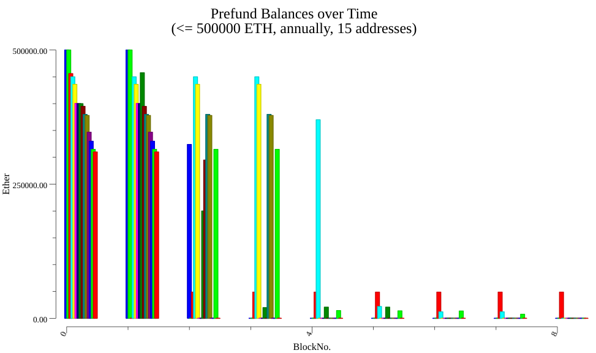

# README

## Overview

This example application retrieves a list of prefund addresses with balances at the start
of the blockchain, fetches their balances at the end of each specified period (month,
quarter, year), and plots the results as a grouped bar chart.

## Prerequisites

Ensure you have the following installed and running:

- Go Version 1.22 or higher
- The latest version of TrueBlocks Core

## Installation

Clone the repository:

```bash
git clone https://github.com/TrueBlocks/trueblocks-core.git
```

Build core ([see documentation](https://trueblocks.io/docs/install/install-core/)) and then navigate to the example directory:

```bash
cd ../examples/balanceChart
```

## Usage

Run the example using the following command:

```bash
go run . [nAddrs] [maxAmt] [period]
```

### Where

- **nAddrs**: (Optional) The number of prefund addresses to retrieve.
- **maxAmt**: (Optional) The maximum amount in wei for the prefund addresses.
- **period**: (Optional) The frequency for balance checks.

### Example

To fetch 15 prefund addresses with a maximum balance of 30000 wei and plot their balances quarterly:

```bash
go run . 15 30000 quarterly
```

### Output

The above will save the chart in the local folder as **ether_balances.png**. It should look something like this.



## Code Structure

| File                | Description                                                                       |
| ------------------- | --------------------------------------------------------------------------------- |
| **main.go**         | Contains the main function and core logic of the application.                     |
| **get_options.go**  | Processes the command-line arguments and retrieves the options.                   |
| **get_prefunds.go** | Fetches the prefund addresses based on the provided options.                      |
| **get_balances.go** | Retrieves the balances for the selected addresses over the specified time period. |
| **pkg/charts**      | Handles the plotting of the balance data.                                         |
| **pkg/dates**       | Manages date-related operations.                                                  |

## Troubleshooting

If you encounter issues, check the following:

- Ensure at least Go Version 1.22.
- Make sure you have a valid Ethereum mainnet RPC configured.
- Ensure TrueBlocks Core is properly installed and configured.
- Verify the command-line arguments are correct and within valid ranges.

For further assistance, refer to the TrueBlocks Documentation.

## License

See the LICENSE file at the root of this repo for details.
