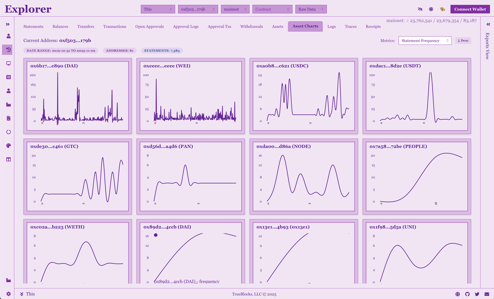
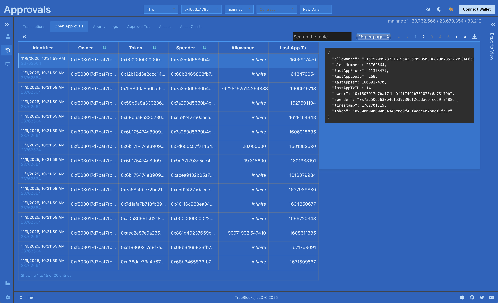
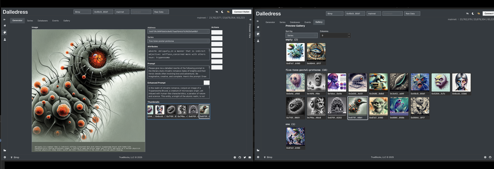

	

		

			

				<h2 class="app-title" style="color: #fff; font-weight: 800;">TrueBlocks Explorer</h2>
				

					
Explore the blockchain like never before with TrueBlocks Explorer. Get complete, accurate, and fast access to transaction data with our revolutionary indexing technology.

					
Features include real-time transaction monitoring, advanced filtering, custom dashboards, and multi-chain support. All running locally on your machine for maximum privacy and speed.

					<a href="mailto:info@quickblocks.io?subject=Join TrueBlocks Explorer Beta" class="btn" style="background-color: #28a745; color: white; padding: 10px 20px; text-decoration: none; border-radius: 5px; display: inline-block; margin-top: 15px;">Join Beta...</a>
				

			

			

				
			

		

	

	

		

			

				<h2 class="app-title">TrueBlocks Approvals</h2>
				

					
Monitor and manage your token approvals across all DeFi protocols. TrueBlocks Approvals gives you complete visibility into what contracts can access your tokens.

					
Stay secure by tracking unlimited approvals, getting alerts for suspicious activity, and easily revoking permissions you no longer need. All powered by TrueBlocks' comprehensive indexing.

					<a href="mailto:info@quickblocks.io?subject=Join TrueBlocks Approvals Beta" class="btn" style="background-color: #28a745; color: white; padding: 10px 20px; text-decoration: none; border-radius: 5px; display: inline-block; margin-top: 15px;">Join Beta...</a>
				

			

			

				
			

		

	

	

		

			

				<h2 class="app-title" style="color: #fff; font-weight: 800;">DalleDress</h2>
				

					
Create unique AI-powered NFT collections with DalleDress. Track your portfolio of NFTs, monitor  prices, and analyze trends.

					
Get detailed transaction histories, rarity analysis, and comprehensive collection overviews. Perfect for collectors, traders, and anyone interested in the NFT space.

					<a href="mailto:info@quickblocks.io?subject=Join DalleDress Beta" class="btn" style="background-color: #28a745; color: white; padding: 10px 20px; text-decoration: none; border-radius: 5px; display: inline-block; margin-top: 15px;">Join Beta...</a>
				

			

			

				
			

		

	

	

		

			

				<h2 class="app-title" style="color: #000; font-weight: 800; text-align: center; margin-bottom: 30px;">More Coming...</h2>
				

					
We have an exciting pipeline of additional applications in planning and early development stages. These innovative tools will further expand TrueBlocks' ecosystem, bringing you even more ways to interact with and analyze blockchain data.

				

				

					<table style="width: 100%; border-collapse: collapse; background-color: rgba(255, 255, 255, 0.1); border-radius: 10px; overflow: hidden;">
						<thead>
							<tr style="background-color: rgba(255, 255, 255, 0.2);">
								<th style="padding: 15px; text-align: left; color: #fff; font-weight: 600; border-bottom: 1px solid rgba(255, 255, 255, 0.2);">mini-dApp</th>
								<th style="padding: 15px; text-align: left; color: #fff; font-weight: 600; border-bottom: 1px solid rgba(255, 255, 255, 0.2);">Description</th>
							</tr>
						</thead>
						<tbody>
							<tr style="border-bottom: 1px solid rgba(255, 255, 255, 0.1);">
								<td style="padding: 12px 15px; color: #fff; font-weight: 500;">BattleCry</td>
								<td style="padding: 12px 15px; color: #fff;">A simple two person game theory game exploring trust</td>
							</tr>
							<tr style="border-bottom: 1px solid rgba(255, 255, 255, 0.1);">
								<td style="padding: 12px 15px; color: #fff; font-weight: 500;">KhedraGuidl</td>
								<td style="padding: 12px 15px; color: #fff;">An extension to BuidlGuidl to allow for managing Khedra</td>
							</tr>
							<tr style="border-bottom: 1px solid rgba(255, 255, 255, 0.1);">
								<td style="padding: 12px 15px; color: #fff; font-weight: 500;">Comparitoor</td>
								<td style="padding: 12px 15px; color: #fff;">Compares TrueBlocks transactional histories to popular web 2.0 APIs and websites (like Etherscan) and far outshines them</td>
							</tr>
							<tr style="border-bottom: 1px solid rgba(255, 255, 255, 0.1);">
								<td style="padding: 12px 15px; color: #fff; font-weight: 500;">DaoManager</td>
								<td style="padding: 12px 15px; color: #fff;">Manage your DAO interactions and voting schedules</td>
							</tr>
							<tr>
								<td style="padding: 12px 15px; color: #fff; font-weight: 500;">PolyMarket</td>
								<td style="padding: 12px 15px; color: #fff;">Manage your Polymarket bets</td>
							</tr>
						</tbody>
					</table>
				

			

		

	

