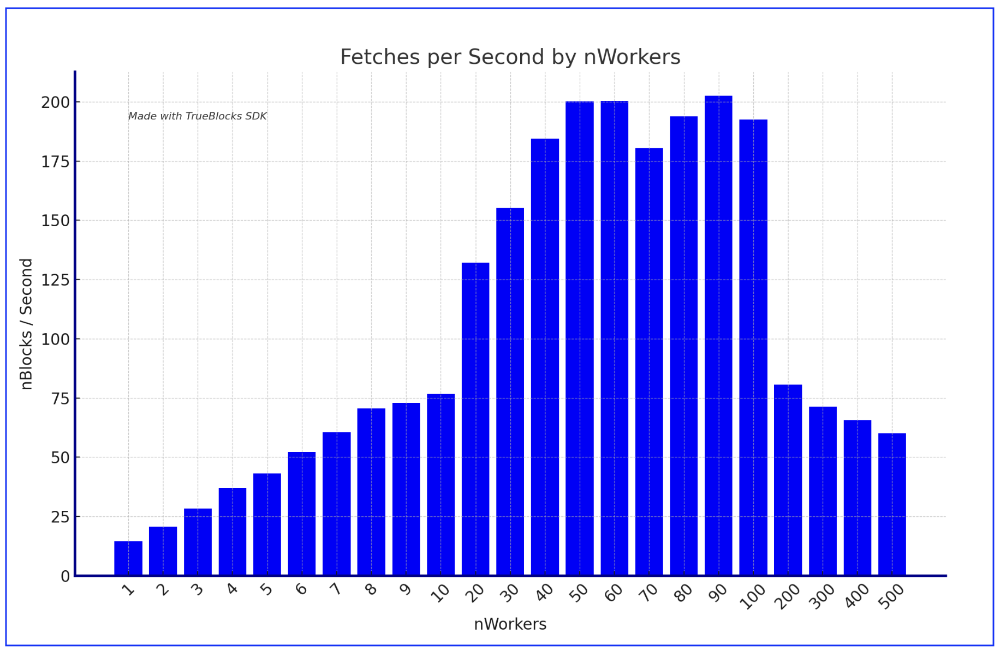

# Example - Find First

This example show a simple example of using the Blocks endpoint to find the first transaction in a given chain. It assumes your installation is set up and running and has an active RPC endpoint. The code makes the assumption (for performance reasons on Ethereum Mainnet) that the first transaction near block 45,000.

## Running the example

The example code is built using the regular build instructions, but you can build and run it locally using

```bash
go build -o ./findFirst ./...
```

which will produce a binary called `findFirst`. You can then run it with

```bash
./findFirst
```

## Blocks Processed per Second by Number of Workers

| nWorkers | nBlocks |  Seconds | perSecond |
| -------: | ------: | -------: | --------: |
|        1 |    2500 | 17195.60 |     14.54 |
|        2 |    2500 | 12085.71 |     20.69 |
|        3 |    2500 |  8819.15 |     28.35 |
|        4 |    2500 |  6764.28 |     36.96 |
|        5 |    2500 |  5788.68 |     43.19 |
|        6 |    2500 |  4795.33 |     52.13 |
|        7 |    2500 |  4128.26 |     60.56 |
|        8 |    2500 |  3541.66 |     70.59 |
|        9 |    2500 |  3423.01 |     73.04 |
|       10 |    2500 |  3258.19 |     76.73 |
|       20 |    2500 |  1892.76 |    132.08 |
|       30 |    2500 |  1611.58 |    155.13 |
|       40 |    2500 |  1354.95 |    184.51 |
|       50 |    2500 |  1248.26 |    200.28 |
|       60 |    2500 |  1247.70 |    200.37 |
|       70 |    2500 |  1385.92 |    180.39 |
|       80 |    2500 |  1288.88 |    193.97 |
|       90 |    2500 |  1234.05 |    202.58 |
|      100 |    2500 |  1298.30 |    192.56 |
|      200 |    2500 |  3102.20 |     80.59 |
|      300 |    2500 |  3501.62 |     71.40 |
|      400 |    2500 |  3803.40 |     65.73 |
|      500 |    2500 |  4158.99 |     60.11 |
|      600 |    2500 |  4543.45 |     55.02 |
|      700 |    2500 |  4962.54 |     50.38 |
|      800 |    2500 |  5223.26 |     47.86 |
|      900 |    2500 |  4756.41 |     52.56 |
|     1000 |    2500 |  5132.93 |     48.71 |

The table above shows the performance of the `findFirst` function for different number of workers. The number of blocks fetched is fixed at 2500. The time taken to fetch the blocks and the rate of fetching is shown in the table. The rate is calculated as the number of blocks fetched per second.

Here's a bar chart:


