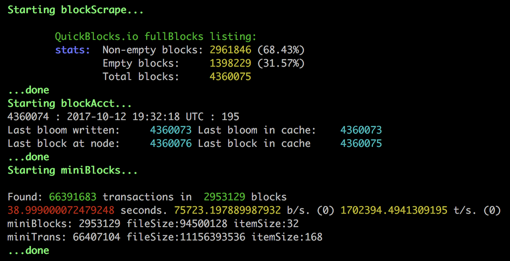

## chifra scrape

The `chifra scrape` app queries the rpcProvider you specify (or your local node if none) using the RPC interface reading each block from any EVM-based blockchain. After extensive optimizations to the data, including  determining each transaction's error status and expanding internal message calls, the blocks are stored in a speed-optimized database for fast retrieval. By doing as much work as possible prior to storage, TrueBlocks is able to achieve significant increases in speed of retrieval over the node.

Using operating system tools such as Linux's `cron` you can easily maintain a  constantly fresh TrueBlocks database. Using TrueBlocks `display strings` technology, it is even easy to populate a regular web 2.0 database and from there a full featured website representing the full state of your smart contract.

### Usage

`Usage:`    chifra scrape [-t|-n|-p|-s|-i|-R|-v|-h] mode  
`Purpose:`  Decentralized blockchain scraper and block cache.

`Where:`  

| Short Cut | Option | Description |
| -------: | :------- | :------- |
|  | mode | control the block and account scrapers, one of [run&#124;quit&#124;pause&#124;restart] (required) |
| -t | --tool <val> | process the index, monitors, or both (none means process timestamps only), one or more of [monitors&#124;index*&#124;none&#124;both] |
| -n | --n_blocks <num> | maximum number of blocks to process (defaults to 5000) |
| -p | --pin | pin new chunks (and blooms) to IPFS (requires Pinata key and running IPFS node) |
| -s | --sleep <double> | the number of seconds to sleep between passes (default 14) |
| -i | --cache_txs | write transactions to the cache (see notes) |
| -R | --cache_traces | write traces to the cache (see notes) |
| -v | --verbose | set verbose level. Either -v, --verbose or -v:n where 'n' is level |
| -h | --help | display this help screen |

#### Other Options

All **TrueBlocks** command-line tools support the following commands (although in some case, they have no meaning):

| Command     | Description                                                                                     |
| ----------- | ----------------------------------------------------------------------------------------------- |
| --version   | display the current version of the tool                                                         |
| --nocolor   | turn off colored display                                                                        |
| --wei       | specify value in wei (the default)                                                              |
| --ether     | specify value in ether                                                                          |
| --dollars   | specify value in US dollars                                                                     |
| --raw       | report JSON data from the node with minimal processing                                          |
| --very_raw  | report JSON data from node with zero processing                                                 |
| --fmt       | export format (where appropriate). One of [ none &#124; txt &#124; csv &#124; json &#124; api ] |
| --to_file   | write the results to a temporary file and return the filename                                   |
| --output:fn | write the results to file 'fn' and return the filename                                          |
| --file:fn   | specify multiple sets of command line options in a file.                                        |

<small>*For the `--file:fn` option, place a series of valid command lines in a file and use the above options. In some cases, this option may significantly improve performance. A semi-colon at the start of a line makes that line a comment.*</small>

**Source code**: [`apps/blockScrape`](https://github.com/TrueBlocks/trueblocks-core/tree/master/src/apps/blockScrape)

