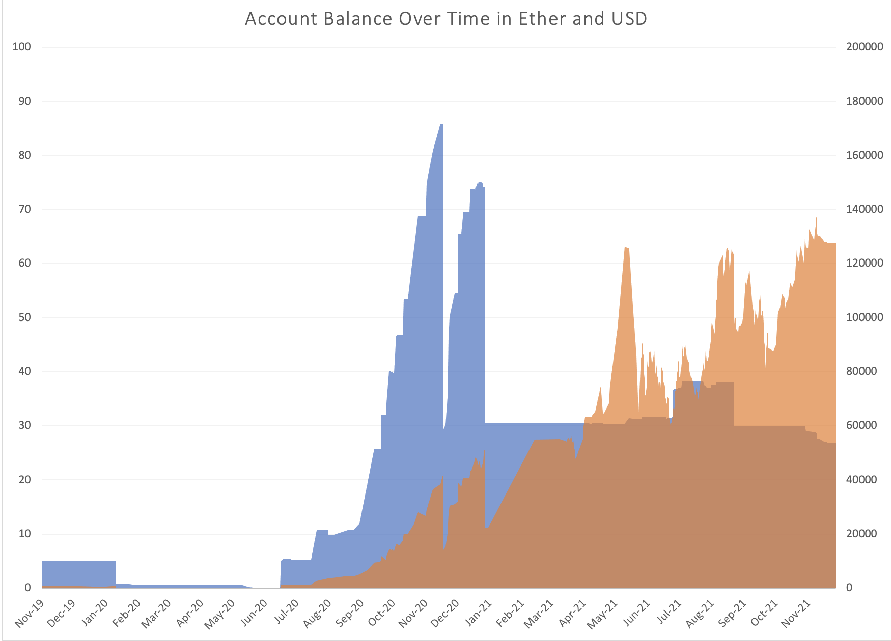

## Dynamic Traverser : balances

A quick example of a [Dynamic Traverser](https://docs.trueblocks.io/blog/dynamic-traversers-for-trueblocks/) to extract balance histories for a given address.

### Running

```[shell]
chifra export --load libbalances.so <address>
```

### Using the Data

You can store the produced data into a file and open it up in an Excel spreadsheet. An example of this, using our own TrueBlocks address,
would be like this:

```
chifra export --load balances 0xf503017d7baf7fbc0fff7492b751025c6a78179b >balances.csv
```

Here's a chart we created with [this data](./data.tar.gz):




### Building

See the instructions in the file [./src/examples/README.md](../../README.md) for more information.
