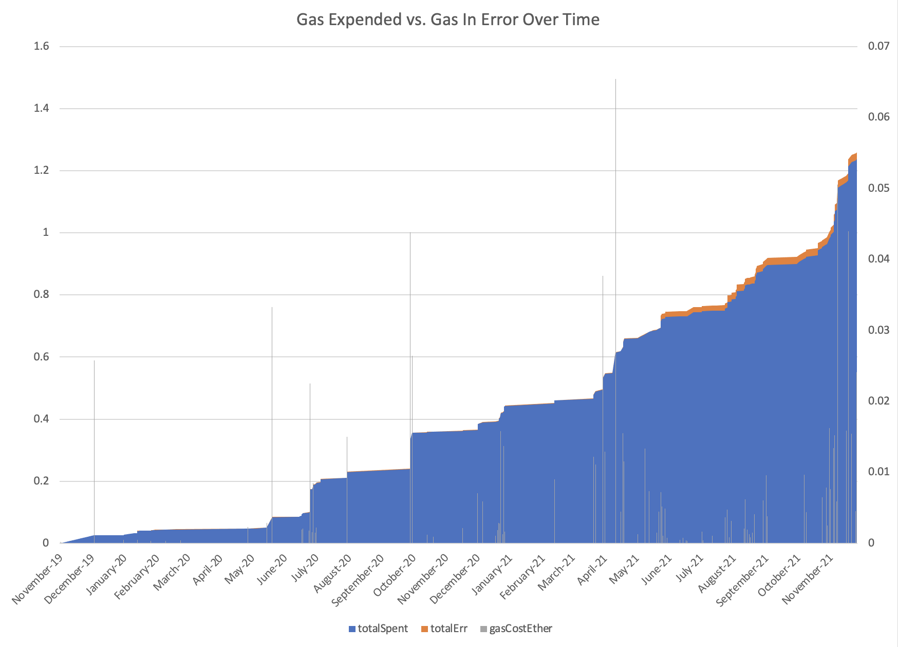

# Dynamic Traverser : gasHole

This example traverser extracts US dollars gas cost for each transaction in the GitCoin DAO Governor contract. The output may be used to reimburse DAO participants for voting, creating sucessfull proposals and other purposes.

## Why is it called gasHole?

Because that's funny. Plus, "into a hole" is where your money goes when you interact with Ethereum.

## What data is produced?

TrueBlocks extracts "every appearance of an address anywhere on the chain." In this case, we extracted data for the GitCoin DAO Governor contract: `0xDbD27635A534A3d3169Ef0498beB56Fb9c937489`.

After installation and syncing the TrueBlocks index, we ran the following command to produce the data described in the table below:

```[bash]
chifra export 0xDbD27635A534A3d3169Ef0498beB56Fb9c937489 --load gasHole | tee by_txs.csv
```

The above command produces a file with the following data fields (columns) with one row for each of the 835 transactions (at the time of this writing).

| Field Name       | Description                                                                                         |
| ---------------- | --------------------------------------------------------------------------------------------------- |
| blockNumber      | The bloc number of the transaction                                                                  |
| transactionIndex | The transaction index within the block of the transaction                                           |
| timestamp        | The timestamp of the transaction                                                                    |
| tx_date          | The data and time of the transaction                                                                |
| from             | The 'from' address (that is, sender). Note, this is always an Externally Owned Address (EOA)        |
| gasUsed          | The amount of gasUsed in this transaction. Note: even failed transactions are recorded.             |
| gasPrice         | The gasPrice sent for this transaction.                                                             |
| gasCost          | The gasCost (in WEI) for the transaction (gasUsed * gasPrice)                                       |
| etherGasCost     | gasCost converted to ether (i.e. divided by 10^18)                                                  |
| spotPrice        | The Uniswap spot price retrieved from the DAI/USD pair at the moment of the transaction (see below) |
| usdGasCost       | The US dollar equivalent of the etherGasCost (i.e. ethGasCost * spotPrice)                          |
| hash             | The hash of the transaction.                                                                        |
| name             | The name (if any) associated with the sender (or 'anon' if none)                                    |
| function         | The name of the function called during the transaction (if known)                                   |
| compressedTx     | The decoded input data field of the transaction (if able to be decoded)                             |

The data is stored in `./by_txs.csv`.

## Post processing the data

The above data is produced as it is encountered. That is, each transaction produces a single row sorted by <date>). We wanted to further explore this data and, while we could have done this in the C++ code, we decided that an easier way was to use `R`.

The `summarize.R` script does that further analysis. For each person who interacted with the DAO (that is, each person), the gas spent in both Ether and USD is summarized by address (in `./by_addr.csv`) and by month within address (in `./by_month.csv`).

We stored these results in Google Sheets as well for your viewing pleasure:

- [Transactions](https://docs.google.com/spreadsheets/d/1eL5K9n3wFtxtT2XYczaSINuXq_WI7RAfZsziNYFJ7tc)
- [By Month within Address](https://docs.google.com/spreadsheets/d/1l0PQxRcxhACfQfS1lzh7qYKTLTz1pnHn5JZhNWBjUQ8)
- [By Address](https://docs.google.com/spreadsheets/d/1yxPsj9xkE1AFRysXJIBjMBqleF4G9iFfl9Bn0BRW00Q)

Our hope is that the GitCoin DAO (or any other DAO -- or any other smart contract, for that matter) might use this data, for example, to re-imburse Stewards (and voters?) for their gas costs. This might be a convienient way to encourage more people to vote on proposals. If they know they will get reimbursed, they might be more likely to vote.

## Building this example

[THIS SECTION WILL BE FLESHED OUR FURTHER SHORTLY]

First, you need to download, build and install TrueBlocks. Instructions for that are here: https://trueblocks.io/docs/install/install-trueblocks/. (We're working on a docker version that will make this much easier.)

Next, change into the current folder and type `make`.

If everything is working properly, the `make` command should produce a large amount of data to your screen and save that same data in a file called `./by_txs.csv`.

## How do we price the transactions

Because TrueBlocks can see every transaction directly and because, on our machines, we have direct access to a locally running node (Erigon on a dAppNode in our offices), we can query the Uniswap pair for DAI/ETH at the
block in which the transaction occurred. (Anyone with access to any RPC endpoint can actually do this, but your milage may vary, particularly due to rate limiting. This proceedure works much better when running against your own node.)

By querying directly against the Uniswap DAI/ETH pair at each transaction, we've created the most accurate US Dollar pricing available. It's 'difficult to argue that the price of Ether at any block is different than the value returned by Uniswap. Price discovery is literally the purpose of Uniswap.

## On chain!

It's important for us to note at this point that everything we've described above is purely on-chain. There is no reliance on any third party oracle, no APIs, no website. Just the node. It may be appearant to a careful reader that running against your own RPC endpoint is also perfectly private.

This is a great example of how decentralized data should work. Any person on Earth should have equal access to this data. All one needs is (a) a computer (such as dAppNode), (b) a locally running node (see dAppNode), and (c) access any data they want (see TrueBlocks).

#RunYourOwnNode!

## The source code

In this section, we will discuss the source code that makes this traverser so powerful. It's remarkably simple. This code is stored in the file `gasHole.cpp` and created by typing `make` in the same folder.

[THIS SECTION WILL BE FLESHED OUT LATER.]

First, we produce a custom traverser class. A custom traverser allows you to carry along certain data throughout the traversal. For example, one might wish to keep totals, averages, or summary tables. In this example, our traverser carries no additional data -- see the `usdprice` example for an example of custom data):

```[c++]
//-----------------------------------------------------------------------
class CTestTraverser : public CTraverser {
  public:
    CTestTraverser(void) : CTraverser("testing") {
    }
};
```

...and return it after its initialized...

```[c++]
extern "C" CTraverser* makeTraverser(uint32_t wanted) {
    CTestTraverser* trav = new CTestTraverser;
    trav->preFunc = header;
    trav->displayFunc = display;
    return trav;
}
```

...this will be the same instance as each appearance is traversed and sent to the `display` function. 

The `header` appearing above simply presents the field headers to the exported data. This function (the one attached to `preFunc`) is called once and only once, and is always called prior to the traversal. A developer might use this function to initialize database connections or open export files as well. Note there is a `postFunc` not shown here where one can clean up open files or connections.

```[c++]
bool header(CTraverser* trav, void* data) {
    cout << "bn" << "\t" << "txid" << "\t" << "timestamp" << "\t" // [ and so on...]
    return true;
}
```

The `display` function is called for each transaction in the address's history. Notice how simple this code is. This simplicity illustrates the amazing capabilities and at the same time the amazing simplicity of TrueBlocks' Dynamic Traversers. All the hard work of the traversal is done internally by TrueBlocks (extracting the history, pulling the data from the chain, presenting the data in a useful format, etc.). The only thing the developer must do is write a simple function to process the data however they wish.

First, we convert the traverser back into our custom type:

```[c++]
//-----------------------------------------------------------------------
bool display(CTraverser* trav, void* data) {
    CTestTraverser* tt = (CTestTraverser*)trav;
    ....
```

...next, we calculate a few things we need to produce our data...

```[c++]
    // The cost of the gas in ether used in this transaction
    double gasCostEther = str_2_Double(trav->trans.Format("[{ETHERGASCOST}]"));

    // The spot price as reported by the Uniswap DAI/ETH pair at this block
    double spotPrice = getPriceInUsd(trav->trans.blockNumber);

    // The US dollar cost of that gas
    double gasCostUsd = (gasCostEther * spotPrice);

    // The associated name for the sender address (if we can find it, `anon` otherwise)
    string name = findName(trav->trans.from);
    ....
```

In the next step, we create a "Custom Display String" (frequently called a "template string") elsewhere. Any data structure in TrueBlocks may be rendered using a Custom Display String. This allows for an immense amount of customization to the output with little-to-no work. In fact, we've written some applications where the end-user may customize his/her own display strings.

```[c++]
const char* STR_OUTPUT_FORMAT =
    "[{blockNumber}]\t"
    "[{transactionIndex}]\t"
    "[{timestamp}]\t"
    "[{date}]\t"
    "[{from}]\t"
    "[{gasUsed}]\t"
    "[{gasPrice}]\t"
    "[{gasCost}]\t"
    "[{etherGasCost}]\t"
    "[{spotPrice}]\t"
    "[{usdGasCost}]\t"
    "[{hash}]\t"
    "[{name}]\t"
    "[{function}]\t"
    "[{compressedTx}]";
    ....
```

...and finally, we present the results, converting the display string to CSV format, the filling in the data we pre-calculated above, and finally rendering the data to the standard output.

```
    string_q fmt = tab_2_Csv(STR_OUTPUT_FORMAT);

    fmt = substitute(fmt, "[{spotPrice}]", double_2_Str(spotPrice, 2));
    fmt = substitute(fmt, "[{usdGasCost}]", double_2_Str(gasCostUsd, 2));
    fmt = substitute(fmt, "[{name}]", acct.name);

    cout << substitute(trav->trans.Format(fmt), " UTC", "") << endl;

    return true;
}
```

The last line of the `display` function returns `true` if we wish to continue the traverser, or `false` if we wish the traversal to stop.

### Using the Data

We've stored these results of this traversal in Google Sheets as well for your viewing pleasure:

- [Transactions](https://docs.google.com/spreadsheets/d/1eL5K9n3wFtxtT2XYczaSINuXq_WI7RAfZsziNYFJ7tc)
- [By Month within Address](https://docs.google.com/spreadsheets/d/1l0PQxRcxhACfQfS1lzh7qYKTLTz1pnHn5JZhNWBjUQ8)
- [By Address](https://docs.google.com/spreadsheets/d/1yxPsj9xkE1AFRysXJIBjMBqleF4G9iFfl9Bn0BRW00Q)


Here's a chart a simple chart we produced using the very interesting data contained in the `compressedTx` field which we've not mentioned earlier. This field represents the actual function calls made by during each transaction in the contract's history. We produced this chart with Google Sheets.


