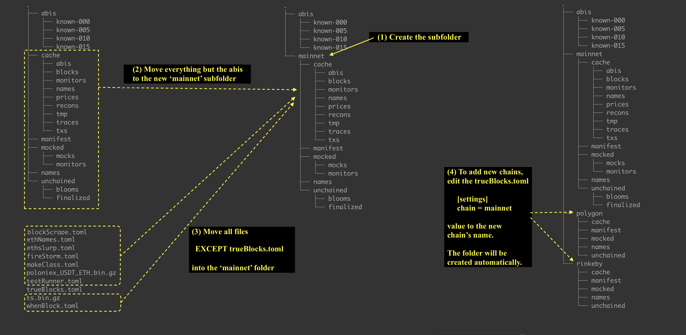

# v0.24.0 Multi-chain

---

(January 2, 2022)

## WORK IN PROGRESS

Do not complete this migration until you are told to do so.

## Why the Change?

With this chain we enter into the world of multi-chain. While the changes here are pretty simple, they are delicate in the sense that you must edit files and folders on your hard drive. It is possible to damage not only your installation of TrueBlocks, but your computer as a whole if you are not careful. Please don't say we didn' warn you.

### What's Changed

This image shows the process your will follow in the "Instructions" section below. It is a four step process. The folders you will be moving are in TrueBlocks' $CONFIG folder (`~/.local/share/trueblocks/` on Linux, `~/Library/Application Support/TrueBlocks/` on Mac).



### Instructions

(1) Find the $CONFIG folder and create a subfolder in that folder

```
cd ~/.local/share/trueblocks           # or ~/Library/Application Support/TrueBlocks on Mac
mkdir -p mainnet
```

(2) Move all the files and folders currently in the $CONFIG folder into the new `mainnet` folder (except the `abis` folder and the file `trueBlocks.toml`.

```
mv cache unchained manifest mocked names mainnet
mv *.gz mainnet
mv *.toml mainnet
mv mainnet/trueBlocks.toml .
```

After this step, your folder structure should look like the middle image above.

(3) To add other chains:

- Edit the `trueBlocks.toml` file
- Either add or edit a value under `[settings]chain = mainnet` to reference one of these supported chains:
  - `mainnet`, `xdai`, `polygon`, `rinkeby`, `georli`
- You may add your own chain, but if you do, you must supply your own genesis files. Please contact us in our discord for more information.

### Other slight changes

The `chifra export --neighbors` option now no longer include the `traceId` field. Additionally, the `reason` field is slightly less informative that it was previously. All of this in service of a significant increase in the speed of the option.

## You're Finished

Please report any problems by creating an issue.

## Previous Migration

[Click here](./README-v0.18.0.md) for the previous migration.
