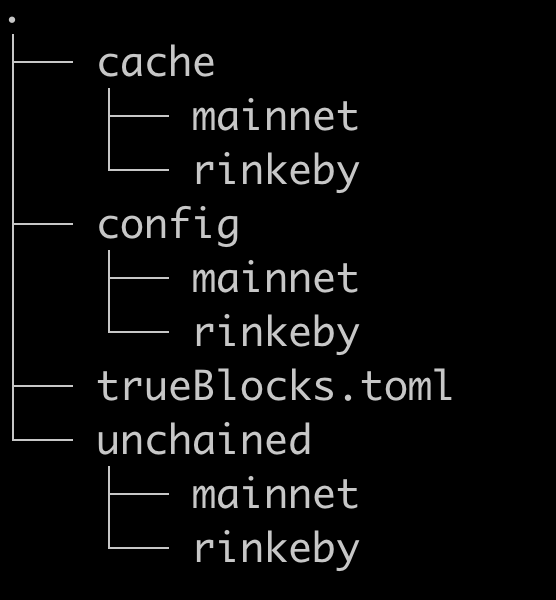

# v0.25.0 Multi-chain

---

(February 10, 2022)

## Why the Change?

With this migration, TrueBlocks enters into the world of multi-chain blockchains.

Under the covers, this was a massive change to our code base. On the surface, it's quite simple: we added the `--chain` option to all commands. We've also pre-configured a few chains for you, but you may add support for any EVM-based chain yourself.

This migration requires you to edit a configuration files and move existing folders to new locations. Be careful, if you make a mistake, you may damage not only your installation of TrueBlocks, but your computer.

Please do not say we didn't warn you.

### What do you need to change?

This migration involves you doing three primary things. You must

- change the location of two folders (`cache` and `unchained` index),  
- edit a configuration file to point to these new folders,  
- remove or move old configuration files and folders.

## Instructions

In the following instructions, we assume you are working on a Linux installation. If you're on a Mac, adjust the paths as appropriate.

### Before you start

- Stop any long running TrueBlocks processes (such as the `chifra scrape` or `chifra serve`). Do not restart them until the migration is complete.

- Move -- do not copy -- move the old `trueBlocks.toml` configuration file. We will need some settings in this file later.

```
mv $HOME/.local/share/trueblocks/trueBlocks.toml ./trueBlocks.save
```

### Pull and rebuild TrueBlocks

- Pull the latest copy of TrueBlocks, switch to the `multi-chain-11` branch, and rebuild. If you've moved or copied the executable files to a different location, remove those old files.

Complete the following instructions from the top of the repo:


```
cd ./build
git pull
git checkout multi-chain-11   # once we merge this change, you will use the 'develop' branch
cmake ../src
make -j 4
```

The above will rebuild the exectuables and create the new multi-chain folder structure. It will also install the newly formatted `trueBlocks.toml` file.

### Did the build work?

Make sure the build worked and you have the latest version:

```
chifra status --terse
```

This should return the following version (or later):

```
chifra version GHC-TrueBlocks//0.25.0-alpha
```

You will also get a warning message pointing you to this page. Until you've completed the migration, this message will continue to display.

### Editing configuration files

**Important:** Before doing anything else, we need to edit a configuration file

Display the values in the old configuration file you saved earlier:

```
cat ./trueBlocks.toml
```

Make note of three values:

```
cachePath = "<cache_path>"
indexPath = "<index_path>"
etherscan_key = "<etherscan_key>"
```

Change your directory to the configuration folder:

```
cd $HOME/.local/share/trueblocks
pwd
```

(on Mac, `pwd` should say `$HOME/Library/Application Support/TrueBlocks`).

Edit the `trueBlocks.toml` file and replace these three values with the values you noted above. Your settings should now look like this:

```
[settings]
cachePath = "<cache_path>"
indexPath = "<index_path>"
etherscan_key = "<etherscan_key>"
defaultChain = "mainnet"
```

You may review, but do not modify, the list of available chains. Documentation for editing changes is in the help file.

Run `chifra status --terse` again. You will get the same warning message.

### Moving existing cache and unchained index folders

**Important:** If you've customized the location of your `cache` or `unchained` folders, adjust these instructions accordingly.
 
Complete the following steps:

- Move the existing cache folders into the chain-specific `mainnet` cache folder:

```
cd $HOME/.local/share/trueblocks/cache
mkdir -p mainnet
mv * mainnet
```

*Note: You may get a warning saying you've tried to move a folder into itself. That's okay.*

- Move existing unchained index folders into the new chain-specific `mainnet` unchained index folder:

```
cd $HOME/.local/share/trueblocks/unchained
mkdir -p mainnet
mv * mainnet
```

*Note: You may get a warning saying you've tried to move a folder into itself. That's okay.*

Run `chifra status --terse` again. You will continue to get the warning message.

### Removing old configuration files

The last step is to remove old configuration files and folders. When you're finished, the root of the TrueBlocks configuration folder should look like this:



**Important:** If you've customized any of TrueBlocks' configuration files other than `trueBlocks.toml`, you should preserve those values. You will find fresh copies of the existing config files in `$HOME/.local/share/trueblocks/config/mainnet`. Move any setting you've customized ***EXCEPT*** the `[requires]` group in `blockScrape.toml`. That config item is no longer needed.

When you're finished, the root configuration folder should contain a single toml file (`trueBlocks.toml`) and four subfolders: `abis`, `config`, `cache`, `unchained`. The `config`, `cache`, and `unchained` subfolders should contain only chain-specific sub-folders (no files). There must be at least one (`mainnet` and may or may not be others).

Continue running `chifra status --terse` until it stops complaining. When it does, you will know you're finished.

## Are you finished?

If you've completed the above steps, you should be able to run any `chifra` command. If `chifra` continues to complain, review the above steps or contact us in discord.

Run `chifra status --terse`.

Once the migration is finished, it will return:

```
<date-time> Client:       erigon/2021.11.3/linux-amd64/go1.16.3 (archive, tracing)
<date-time> TrueBlocks:   GHC-TrueBlocks//0.25.0-alpha (eskey, no pinkey)
<date-time> Config Path:  /Users/tb/Library/Application Support/TrueBlocks/
<date-time> Chain (ids):  mainnet (1,1)
<date-time> Cache Path:   /Users/tb/Library/Application Support/TrueBlocks/cache/mainnet/
<date-time> Index Path:   /Users/tb/Library/Application Support/TrueBlocks/unchained/mainnet/
<date-time> RPC Provider: http://localhost:8545/
```

## You're Finished

Please see the help file on our website for information on using the new `--chain` options to `chifra`.

Please report any problems by creating an issue.

## Previous Migration

[Click here](./README-v0.18.0.md) for the previous migration.
