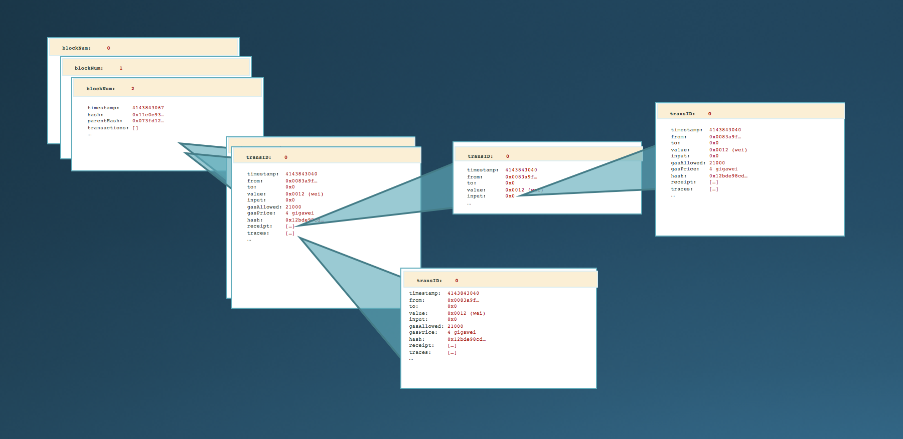

## Tools

The `tools` folder contains command-line tools that serve primarily as examples of using the QuickBlocks [libraries](../libs). You will find that the source code for each of the individual tools is quite simple.

In a certain sense, each tool give you access to a different part of the Etheruem data structure.

While primarily illustrative, these tools are also useful. For example, you may find them useful in testing and scripting scenarios. Each is fully documented further in its own README.md file.

#### Tools

+ [getBlock](getBlock) / [getTrans](getTrans) / [getReceipt](getReceipt) / [getLogs](getLogs) - These programs allows you to retrieve primary data structures of the Ethereum blockchain. By default, each tool retrieves a cached version of the blockchain data from QuickBlocks, however, they may also be used to query the Ethereum node directly. We use these tools in various testing and scripting scenarios.

+ [getTrace](getTrace) / [getBloom](getBloom) - These programs are similar to the previous group but give you access to the lesser of Ethereum's data structures.

+ [getBalance](getBalance) / [getTokenBal](getTokenBal) - Unlike the other `get` commands in this folder, `getBalance` and `getTokenBal` operate soley against the node. These programs retrieve balances (either *ether* balance or *token* balance) from one or more addresses at a given block. We use these program in testing QuickBlocks [monitors](../monitors) and to ensure that our cacheing mechanisms work properly.

+ [isContract](isContract) - This app returns `true` or `false` depending if the address is a smart contract or not. It may also be used to pull the actual byte code of the contract, if present. Furthermore, it can be used to compare two Ethereum addresses to see if they hold the same byte code.

+ [whenBlock](whenBlock) / [whereBlock](whereBlock) - `whenBlock` is a surprisingly handy tool that allows you to enter either a block number and it returns that block's date, or a date and it returns the block just prior to that date. It makes exploring and analyzing the blockchain much easier because you don't have to remember block numbers. `whereBlock` returns 'cache,' 'node,' or 'remote' depending on where it finds the given block. Again, these tools are helpful for developers.

+ [ethName](ethName) - This simple tool provides a rudimentary service attaching Ethereum address to names and visa versa. It may be used as a simple reminder of ethereum addresses vs. user-specified names. In the future, we will connect this to the ENS system.

+ [bloomScan](../../src/samples/bloomScan) - This simple tool provides a simple visualization of the blockchain's bloom filters in an effort to understand if the chain is "filling up".

#### Scripts

+ [scripts](scripts) - A collection of simple bash shell scripts that make working with the blockchain simpler.

    - **4byte** - This script querys the [4byte directory](https://www.4byte.directory/) looking for matching function and/or event signatures given a function or event name, or visa-versa.

    - **ethgoog** - This script searches google for a given Ethereum address while removing any search engine results matching well-known blockchain scrapers. This makes it easier to find references to an addresses if one it trying to attach that addresses to a human name.

    - **ethscan** - This script opens [Etherscan](http://etherscan.io) with the given block number, block hash, transaction hash or Ethereum address. While it is a centralized solution, Etherscan provides an easily accessible list of transactions for an address.

    - **latestBlock** - This simple script simply calls [whenBlock](whenBlock) with a parameter of `latest`.

    - **openRPC** / **openYP** - We use these two simple scripts to open web pages with much needed reference materials such as the RPC specifications and the Yellow Paper.
